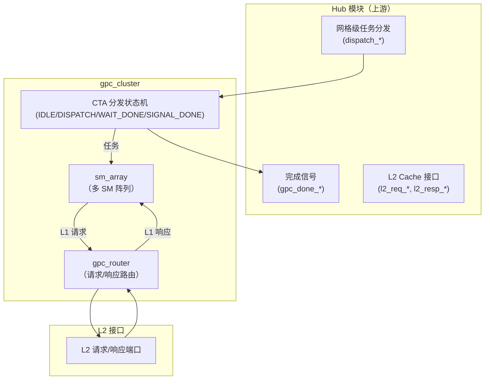
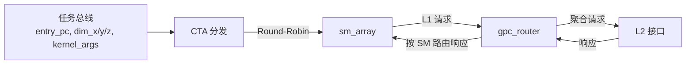

# gpc_cluster 设计说明

本文档描述 `rtl/gpc/gpc_cluster.v`：GPC 顶层模块，集成 SM 阵列和路由器，处理 CTA 分发和屏障。

---

## 架构图

### 顶层框图

### 数据路径概要

---

## 架构说明

- **定位**：`gpc_cluster` 是 GPC（Graphics Processing Cluster）的顶层模块，负责协调和管理多个 SM（Streaming Multiprocessor）的执行。
- **CTA 分发**：实现了一个状态机，以 Round-Robin 方式将计算块（CTA/Block）分发到各个 SM。
- **集成组件**：
  - `sm_array`：封装多个 SM，提供任务分发和 L1 聚合接口
  - `gpc_router`：路由各 SM 的 L1 请求到 L2，并将 L2 响应路由回目标 SM
- **状态机**：包含四个状态：IDLE（空闲）、DISPATCH（分发中）、WAIT_DONE（等待完成）、SIGNAL_DONE（信号完成）
- **简化设计**：当前实现中，1 个 block = 1 个 warp，完整实现中 1 个 block 会包含多个 warp 分布在不同 SM 上

---

## 端口说明

### 时钟与复位

| 端口     | 方向 | 说明        |
|----------|------|-------------|
| `clk`    | in   | 时钟        |
| `rst_n`  | in   | 异步低有效复位 |

### 任务分发（来自 Hub 模块）

| 端口              | 位宽        | 说明 |
|-------------------|-------------|------|
| `grid_entry_pc`   | 64          | 网格入口 PC |
| `grid_dim_x`      | 16          | 网格中 X 维度的 block 总数 |
| `grid_dim_y`      | 16          | 网格中 Y 维度的 block 总数 |
| `grid_dim_z`      | 16          | 网格中 Z 维度的 block 总数 |
| `kernel_args`     | 32          | 内核参数指针 |
| `dispatch_valid`  | 1           | 分发有效信号 |
| `dispatch_ready`  | 1           | 就绪接收新任务信号 |

### 完成信号（到 Hub 模块）

| 端口               | 方向 | 说明 |
|--------------------|------|------|
| `gpc_done_valid`   | out  | GPC 完成信号 |
| `gpc_done_ready`   | in   | Hub 就绪接收完成信号 |

### L2 接口

| 端口               | 位宽        | 方向 | 说明 |
|--------------------|-------------|------|------|
| `l2_req_addr`      | `ADDR_W`    | out  | L2 请求地址 |
| `l2_req_data`      | `DATA_W`    | out  | L2 请求数据 |
| `l2_req_wr_en`     | 1           | out  | L2 写使能 |
| `l2_req_be`        | 16          | out  | L2 字节使能 |
| `l2_req_valid`     | 1           | out  | L2 请求有效 |
| `l2_req_ready`     | 1           | in   | L2 就绪接收请求 |
| `l2_resp_data`     | `DATA_W`    | in   | L2 响应数据 |
| `l2_resp_valid`    | 1           | in   | L2 响应有效 |
| `l2_resp_ready`    | 1           | out  | 就绪接收 L2 响应 |

### 状态

| 端口                 | 位宽         | 说明 |
|----------------------|--------------|------|
| `sm_idle_status`     | `NUM_SM`     | 各 SM 空闲状态 |
| `blocks_remaining`   | 16           | 尚未分发的 block 数量 |

### 参数

| 参数          | 默认值 | 含义 |
|---------------|--------|------|
| `NUM_SM`      | 4      | SM 个数 |
| `SM_ID_W`     | `$clog2(NUM_SM)` | SM 编号位宽 |
| `NUM_WARPS`   | 32     | 每 SM warp 数 |
| `WARP_ID_W`   | 5      | Warp 编号位宽 |
| `DATA_W`      | 128    | 数据宽度 |
| `ADDR_W`      | 64     | 地址宽度 |

---

## 模块说明

| 实例/层次 | 模块名        | 作用 |
|-----------|---------------|------|
| `u_sm_array` | `sm_array` | SM 阵列，集成多个 SM 核心，提供任务分发和 L1 聚合接口 |
| `u_router` | `gpc_router` | 路由器，将各 SM 的 L1 请求路由到 L2，并将响应路由回目标 SM |
| CTA 分发状态机 | （本模块内） | 以 Round-Robin 方式分发 block 到 SM，管理整个网格的执行状态 |

---

## 数据流说明

### CTA 分发流程

1. **IDLE 状态**：等待 `dispatch_valid` 信号，接收到后进入 DISPATCH 状态
2. **DISPATCH 状态**：
   - 初始化 block 计数器（x, y, z）
   - 计算总 block 数：`total_blocks = grid_dim_x × grid_dim_y × grid_dim_z`
   - 以 Round-Robin 方式选择下一个 SM
   - 当 `sm_array_task_valid` 和 `sm_array_task_ready` 都有效时，发送任务到 SM
   - 更新 block 计数器（x 优先，然后 y，然后 z）
   - 增加 `active_blocks` 计数
   - 当所有 block 都分发完后，进入 WAIT_DONE 状态
3. **WAIT_DONE 状态**：等待所有 block 执行完成（简化版使用 `sm_idle_status` 检测）
4. **SIGNAL_DONE 状态**：发送 `gpc_done_valid` 信号，等待 Hub 接收后返回 IDLE

### 内存请求流程

1. 各 SM 通过 `sm_array` 发送 L1 请求
2. `gpc_router` 接收来自 `sm_array` 的请求，聚合后发送到 L2
3. L2 响应通过 `gpc_router` 路由回目标 SM
4. `sm_array` 将响应分发给正确的 SM

---

## 功能说明

1. **网格级任务分发**：接收 Hub 模块的网格任务，包含网格维度和入口 PC
2. **CTA 按 Round-Robin 分发**：将计算块以轮询方式分发给各个 SM，实现负载均衡
3. **多 SM 集成管理**：通过 `sm_array` 管理多个 SM 实例，提供统一的任务和内存接口
4. **内存请求路由**：通过 `gpc_router` 路由 SM 的 L1 请求到 L2，并将响应路由回目标 SM
5. **执行状态追踪**：追踪已分发和活跃的 block 数量，监控 SM 空闲状态
6. **完成信号生成**：在所有 block 执行完成后，向 Hub 模块发送完成信号

---

## 验证说明

### 建议验证环境

- 仿真：**Verilator** + C++ testbench（见 `tb/gpc_cluster/Makefile` 与 `tb_gpc_cluster.cpp`）。
- 波形：开启 `--trace` 输出 VCD，便于核对分发状态机、SM 选择、任务握手等。

### 需要验证的功能点

| 编号 | 功能 | 检查要点 |
|------|------|----------|
| V1 | 复位 | 复位后状态机在 IDLE，各端口在合理初态；无异常 X |
| V2 | 任务接收与准备 | `dispatch_ready` 在 IDLE 状态为 1，其他状态为 0 |
| V3 | 状态机转换 | 从 IDLE → DISPATCH → WAIT_DONE → SIGNAL_DONE → IDLE 的正确转换 |
| V4 | Round-Robin 分发 | block 按顺序分发到 SM 0, 1, 2, 3（假设 NUM_SM=4），循环往复 |
| V5 | Block 计数器 | x/y/z 计数器正确递增，达到维度后正确回绕 |
| V6 | `blocks_remaining` 计算 | 剩余 block 数正确递减 |
| V7 | `active_blocks` 管理 | 分发时递增，完成时递减（注意当前简化实现的检测方式） |
| V8 | 完成检测 | 所有 block 分发并执行完成后，进入 WAIT_DONE 并最终到 SIGNAL_DONE |
| V9 | `gpc_done_valid` 握手 | 在 SIGNAL_DONE 状态正确发送完成信号，`gpc_done_ready` 有效后返回 IDLE |
| V10 | 内存请求透传 | L2 接口请求/响应正确地在 `sm_array`、`gpc_router` 和外部之间传递 |
| V11 | `sm_idle_status` 观测 | 正确反映各 SM 的空闲状态 |

### Testbench 编写要点

1. **DUT 实例化**：顶层为 `gpc_cluster`，时钟/复位与 Hub 侧任务激励、L2 侧从模型分离。
2. **任务激励**：
   - 在 `posedge` 前驱动 `dispatch_*` 信号
   - 设置合理的 `grid_dim_x/y/z`（例如 2×2×1 或 4×1×1 用于简单测试）
   - 用 `dispatch_valid && dispatch_ready` 打拍投递任务
3. **L2 从模型**：
   - 在 `l2_req_valid` 时根据策略置位 `l2_req_ready`（可恒 1 或随机反压）
   - 响应通道：在请求被接受后的若干周期返回 `l2_resp_valid`
4. **SM 完成模拟**：
   - 由于当前简化实现使用 `sm_idle_status` 检测完成，需要通过 `sm_array` 内部或外部方式使 SM 进入空闲状态
   - 可以通过直接驱动或通过任务执行完成来实现
5. **状态观测**：
   - 检查状态机当前状态
   - 检查 `block_counter_x/y/z` 的变化
   - 检查 `blocks_remaining` 和 `active_blocks` 的值
   - 检查 `next_sm_id` 的 Round-Robin 变化
   - 必要时在 Verilator 中将关键子模块信号标为 `public` 以观测内部状态
6. **回归**：
   - 单 SM 情况（NUM_SM=1）
   - 多 SM 情况（NUM_SM=4）
   - 不同网格维度（1D、2D、3D）
   - 零维度边界情况
   - L2 反压场景

---

## 相关文件

| 路径 | 说明 |
|------|------|
| `rtl/gpc/gpc_cluster.v` | 本模块 RTL |
| `rtl/gpc/sm_array.v` | SM 阵列 |
| `rtl/gpc/gpc_router.v` | GPC 路由器 |
| `rtl/gpc/doc/sm_array.md` | sm_array 文档 |
| `rtl/gpc/doc/gpc_router.md` | gpc_router 文档 |
| `rtl/gpc/tb/gpc_cluster/Makefile` | Verilator 编译脚本（用户本地执行 `make`） |
| `rtl/gpc/tb/gpc_cluster/tb_gpc_cluster.cpp` | C++ 测试平台示例 |