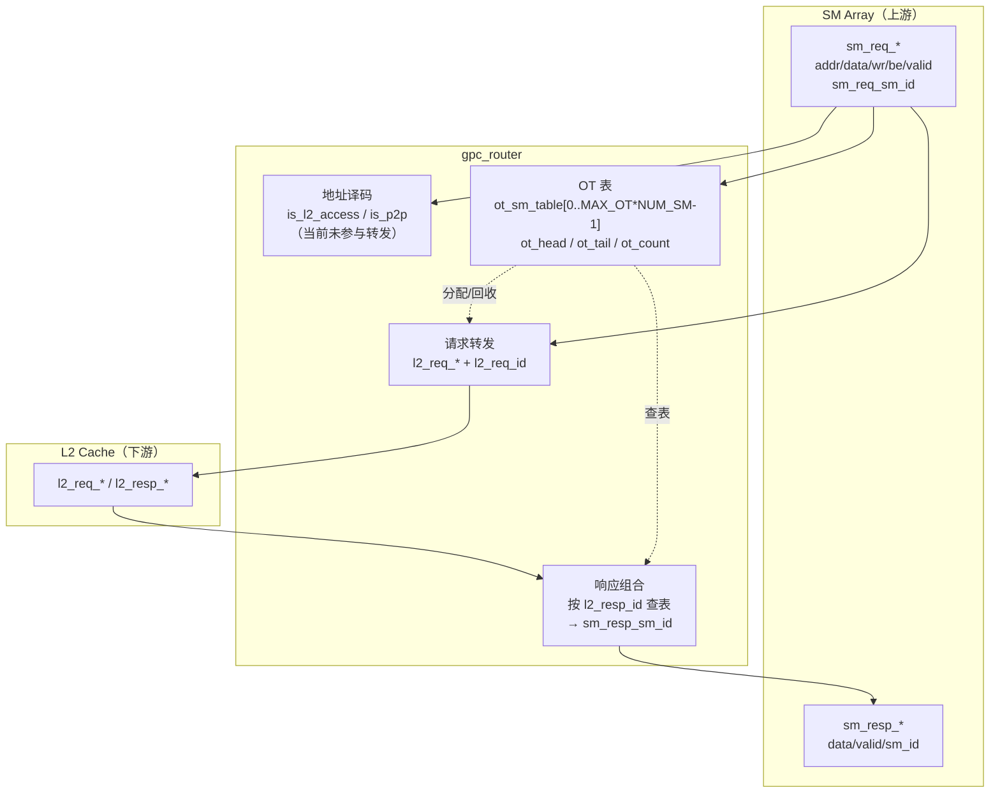
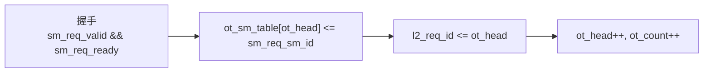
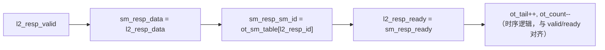

# gpc_router 设计说明

本文档描述 `rtl/gpc/gpc_router.v`：GPC 内将 **多路 SM 聚合内存请求** 转发至 **L2 缓存端口**，通过 **事务 ID（OT）表** 记录来源 SM，并在 **L2 读响应返回** 时把数据与 `sm_resp_sm_id` 路由回上游。

---

## 架构图

### 顶层框图

### 请求与 OT 分配（概念）

### 响应路由（概念）

---

## 架构说明

- **定位**：处于 **SM 阵列聚合口** 与 **GPC 外 L2 单端口** 之间，解决「多主一从」下的 **请求汇聚** 与 **按事务返回源 SM**。
- **Outstanding Transaction（OT）**：为每个被接受的请求分配 **单调递增的 `l2_req_id`**（实现上等于分配时刻的 `ot_head`），在 `ot_sm_table` 中保存 **该事务对应的 `sm_req_sm_id`**。L2 必须在响应上带回 **`l2_resp_id`**，路由器用其 **组合读出** 正确的 `sm_resp_sm_id`。
- **容量**：最多 **`MAX_OT * NUM_SM`** 笔在途事务（默认 `8 * 4 = 32`），`ot_full` 时 **不再接受** 新请求（`sm_req_ready` 拉低）。
- **顺序假设**：`ot_tail` 在每次 **`l2_resp_valid && l2_resp_ready`** 时 `+1`，与 **FIFO 顺序完成** 的语义一致；若 L2 乱序返回，仅靠当前 RTL **无法** 用 `ot_tail` 与表项正确配对（需另行设计或约束 L2 保序）。
- **地址路由**：代码中定义了 `is_l2_access`（`addr[63:48]==16'h0000`）与 `is_p2p`，**当前版本未接入数据路径**，所有已接受请求 **均按 L2 转发**；P2P 为预留注释。

---

## 端口说明

### 时钟与复位

| 端口    | 方向 | 说明           |
|---------|------|----------------|
| `clk`   | in   | 时钟           |
| `rst_n` | in   | 异步低有效复位 |

### 来自 SM 阵列（上游请求）

| 端口           | 位宽        | 说明 |
|----------------|-------------|------|
| `sm_req_addr`  | `ADDR_W`    | 请求地址 |
| `sm_req_data`  | `DATA_W`    | 写数据 |
| `sm_req_wr_en` | 1           | 写使能 |
| `sm_req_be`    | 16          | 字节使能 |
| `sm_req_valid` | 1           | 请求有效 |
| `sm_req_ready` | 1           | 路由器可接受（受 L2 反压与 OT 满影响） |
| `sm_req_sm_id` | `SM_ID_W`   | 来源 SM 编号 |

### 至 SM 阵列（上游响应）

| 端口            | 位宽     | 说明 |
|-----------------|----------|------|
| `sm_resp_data`  | `DATA_W` | 读回数据（来自 L2） |
| `sm_resp_valid` | 1        | 响应当拍有效 |
| `sm_resp_ready` | 1        | SM 侧可接收 |
| `sm_resp_sm_id` | `SM_ID_W`| 响应对应的 SM（查表） |

### 至 L2（下游请求）

| 端口           | 位宽        | 说明 |
|----------------|-------------|------|
| `l2_req_addr`  | `ADDR_W`    | 地址 |
| `l2_req_data`  | `DATA_W`    | 写数据 |
| `l2_req_wr_en` | 1           | 写使能 |
| `l2_req_be`    | 16          | 字节使能 |
| `l2_req_valid` | 1           | 请求有效 |
| `l2_req_ready` | 1           | L2 可接收 |
| `l2_req_id`    | `OT_ID_W`   | 事务 ID（OT 槽位） |

### 来自 L2（下游响应）

| 端口            | 位宽      | 说明 |
|-----------------|-----------|------|
| `l2_resp_data`  | `DATA_W`  | 读数据 |
| `l2_resp_valid` | 1         | 响应有效 |
| `l2_resp_ready` | 1         | 路由器可接收（等于 `sm_resp_ready`） |
| `l2_resp_id`    | `OT_ID_W` | 必须与曾发出的 `l2_req_id` 一致以正确路由 |

### 参数

| 参数        | 默认值 | 含义 |
|-------------|--------|------|
| `NUM_SM`    | 4      | SM 个数 |
| `SM_ID_W`   | `$clog2(NUM_SM)` | SM 编号位宽 |
| `ADDR_W`    | 64     | 地址位宽 |
| `DATA_W`    | 128    | 数据位宽 |
| `MAX_OT`    | 8      | 每 SM 意义下的 OT 深度参数，总槽位数为 `MAX_OT*NUM_SM` |
| `OT_ID_W`   | `$clog2(MAX_OT*NUM_SM)` | 事务 ID 位宽 |

---

## 模块说明

| 区域 | 说明 |
|------|------|
| 地址译码 | `is_l2_access`、`is_p2p` 仅定义，**未影响** 当前转发逻辑。 |
| OT 管理 | `ot_sm_table` 按 `ot_head` 写入 `sm_req_sm_id`；`ot_count`/`ot_head`/`ot_tail` 维护在途数量与 FIFO 边界（与响应回收配合）。 |
| `sm_req_ready` | `assign sm_req_ready = l2_req_ready && !ot_full;` |
| 请求时序 | 在 `sm_req_valid && sm_req_ready` 时打拍至 `l2_req_*`，并 `l2_req_valid<=1`（同周期默认先拉低再置位）。 |
| 响应组合 | `l2_resp_valid` 为真时驱动 `sm_resp_*`；`l2_resp_ready` 直连 `sm_resp_ready`。 |
| 响应回收 | `l2_resp_valid && l2_resp_ready` 时 `ot_tail`、`ot_count` 更新。 |

---

## 数据流说明

1. **请求路径**：SM 置 `sm_req_valid` 且 `sm_req_ready==1` → 一拍内 `ot_sm_table[ot_head]` 写入 `sm_req_sm_id`，`l2_req_id` 为当前 `ot_head`，随后 `ot_head`、`ot_count` 递增；`l2_req_*` 载荷来自 `sm_req_*`。
2. **反压**：`l2_req_ready==0` 或 `ot_full` 时 `sm_req_ready==0`，上游需保持请求稳定直至握手完成。
3. **响应路径**：L2 置 `l2_resp_valid` 并给出 `l2_resp_id` → 组合逻辑输出 `sm_resp_data`、`sm_resp_valid`、`sm_resp_sm_id = ot_sm_table[l2_resp_id]`；当 `sm_resp_ready==1` 时完成回收（`ot_count` 递减等）。

---

## 功能说明

- 将 **单路 SM 风格请求** 转为 **带事务 ID 的 L2 请求**，并保存 **SM 来源**。
- 将 **L2 读响应**（及有效时的数据）广播为 **SM 侧响应总线**，并用 **`l2_resp_id` 恢复 `sm_resp_sm_id`**。
- 通过 **OT 满** 限制在途事务，避免表项溢出。

---

## 验证说明

### 建议验证的功能点

| 序号 | 功能 | 期望行为 |
|------|------|----------|
| 1 | 复位 | `l2_req_valid` 为 0；OT 指针/计数可回到初始状态（由仿真观测）。 |
| 2 | 单事务握手 | `sm_req_valid && sm_req_ready` 时，`l2_req_valid` 置位，`l2_req_id` 与 `ot_head` 分配一致，`l2_req_*` 与 `sm_req_*` 一致。 |
| 3 | `sm_resp_sm_id` 路由 | `l2_resp_id` 等于某次请求的 `l2_req_id` 时，`sm_resp_sm_id` 等于当时记录的 `sm_req_sm_id`。 |
| 4 | L2 反压 | `l2_req_ready=0` 时 `sm_req_ready=0`（在 OT 未满前提下）。 |
| 5 | OT 满 | 连续发起请求直至 `ot_full`，此时 `sm_req_ready=0`，不再增加在途。 |
| 6 | 响应消费 | `l2_resp_valid && l2_resp_ready` 后可在下一请求场景下再次接受 SM 请求（配合释放 OT）。 |
| 7 | 同拍请求与响应 | 同一周期既有新请求握手又有响应握手时，`ot_count` 先加后减或并行更新符合 RTL（需波形确认）。 |

### 已知限制（验证时需知）

- **地址高位** 不改变当前是否发往 L2；若产品规格要求非 L2 区域拒绝或走 P2P，需后续 RTL 变更后再验。
- **乱序响应**：当前 `ot_tail` 回收方式与 **按 `l2_resp_id` 查表** 混合；验证时应 **先按设计意图保序 L2**，或单独做乱序压力以暴露规格与实现的差距。

---

## Testbench 怎么写

1. **时钟/复位**：固定周期 `tick()`，复位若干周期后释放 `rst_n`。
2. **L2 行为模型**：  
   - 在 `l2_req_valid && l2_req_ready` 时 **记录** `l2_req_id`、地址、写数据、`wr_en` 等；  
   - 可 **固定延迟** 若干周期后，驱动 `l2_resp_valid=1`，`l2_resp_id` 与记录的 ID 一致，`l2_resp_data` 为期望读数据。
3. **SM 侧激励**：驱动 `sm_req_*`、`sm_req_sm_id`，仅在 `sm_req_ready==1` 时与 `sm_req_valid` 完成握手；地址可使用 `addr[63:48]=16'h0000` 以符合文档中的 L2 区域（虽当前 RTL不检查）。
4. **自检**：在 `sm_resp_valid` 为真且下游 `sm_resp_ready=1` 的周期，检查 `sm_resp_sm_id` 与 **发起请求时的 SM** 是否一致；数据是否与 L2 模型一致。
5. **波形**：Verilator 开 `--trace`，用 VCD 查看 `ot_head`/`ot_count`/`l2_req_id`/`l2_resp_id` 对齐关系。

工程已提供 **Verilator** 参考环境：`rtl/gpc/tb/gpc_router/Makefile` 与 `tb_gpc_router.cpp`，在 `tb/gpc_router` 目录执行 `make` / `make run` 即可编译运行（需本机安装 `verilator`）。

---

## 仿真文件位置

| 文件 | 说明 |
|------|------|
| `rtl/gpc/tb/gpc_router/Makefile` | Verilator 编译与链接 |
| `rtl/gpc/tb/gpc_router/tb_gpc_router.cpp` | C++ 激励与基础自检 |
