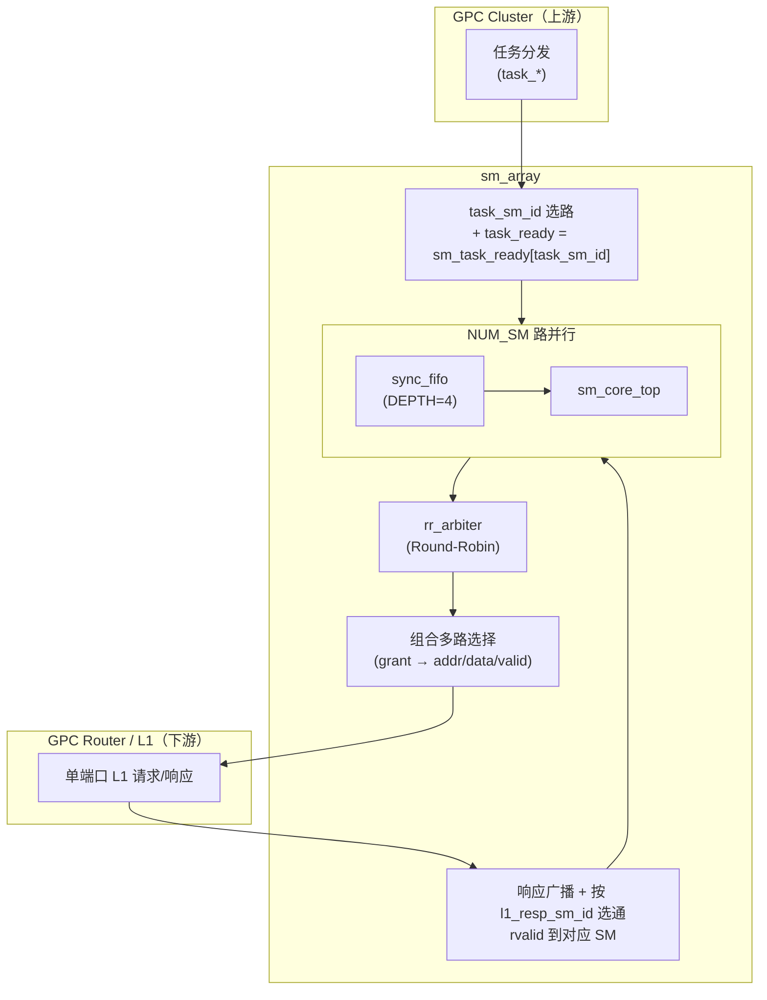
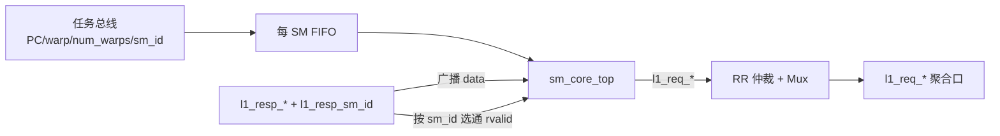

# sm_array 设计说明

本文档描述 `rtl/gpc/sm_array.v`：GPC 内多路 SM 阵列、每 SM 任务 FIFO、以及汇聚到单一 L1 端口的请求仲裁与响应路由。

---

## 架构图

### 顶层框图

### 数据路径概要

---

## 架构说明

- **定位**：`sm_array` 是 GPC 内 **多个 SM 核心的阵列封装**，对上提供 **按 `task_sm_id` 分发的任务接口**，对下提供 **单一 L1 请求主端口** 与 **带 `l1_resp_sm_id` 的响应返回路径**。
- **解耦**：每个 SM 前级有 **小深度 `sync_fifo`（深度 4）**，用于在 GPC 调度与 SM 握手节奏不一致时做 **浅缓冲**。
- **请求侧**：各 SM 的 `l1_req_valid` 组成请求向量，经 **`rr_arbiter` 轮询仲裁**；仲裁结果通过组合逻辑选出 **一路 SM 的地址/写数据/写使能/valid** 驱动到聚合 `l1_req_*`。
- **响应侧**：`l1_resp_data` **广播到所有 SM**；`l1_resp_valid` 与 **`l1_resp_sm_id` 相等** 的那一路 SM 才收到有效的 `l1_rdata_valid`；各 SM 的 `l1_req_ready` 由顶层响应口相关信号推导（见下文数据流）。
- **状态输出**：`sm_idle` 由 `!sm_task_valid[i]` 简化得到；`sm_done` 来自各 `sm_core_top` 的 `task_done`。

---

## 端口说明

### 时钟与复位

| 端口     | 方向 | 说明        |
|----------|------|-------------|
| `clk`    | in   | 时钟        |
| `rst_n`  | in   | 异步低有效复位 |

### 任务分发（来自 GPC Cluster）

| 端口              | 位宽        | 说明 |
|-------------------|-------------|------|
| `task_entry_pc`   | 64          | 任务入口 PC |
| `task_warp_id`    | `WARP_ID_W` | 起始 warp 编号 |
| `task_num_warps`  | 5           | 本任务激活的 warp 数量 |
| `task_sm_id`      | `SM_ID_W`   | 目标 SM 编号 |
| `task_valid`      | 1           | 任务有效 |
| `task_ready`      | 1           | 目标 SM 可接收（见下） |

**`task_ready` 行为**：`assign task_ready = sm_task_ready[task_sm_id];`  
仅 **被选中的 `task_sm_id` 对应 SM** 的 `task_ready` 反映到全局 `task_ready`，与 AXI 单点反压一致：主机需在 `task_valid && task_ready` 时完成握手。

### 聚合 L1（至 GPC Router）

| 端口           | 位宽     | 说明 |
|----------------|----------|------|
| `l1_req_addr`  | `ADDR_W` | 请求地址（仲裁后） |
| `l1_req_data`  | `L1_DATA_W` | 写数据 |
| `l1_req_wr_en` | 1        | 写使能 |
| `l1_req_be`    | 16       | 字节使能（当前实现固定 `16'hFFFF`） |
| `l1_req_valid` | 1        | 请求有效 |
| `l1_req_ready` | 1        | 下游可接收请求 |

### L1 响应（自 Router 返回）

| 端口              | 位宽        | 说明 |
|-------------------|-------------|------|
| `l1_resp_data`    | `L1_DATA_W` | 读回数据（广播进各 SM） |
| `l1_resp_valid`   | 1           | 响应当拍有效 |
| `l1_resp_ready`   | 1           | 本阵列对响应的反压 |
| `l1_resp_sm_id`   | `SM_ID_W`   | 响应对应的 SM 编号 |

### 状态

| 端口      | 位宽     | 说明 |
|-----------|----------|------|
| `sm_idle` | `NUM_SM` | 每 SM：无 FIFO 输出任务时置位（简化定义） |
| `sm_done` | `NUM_SM` | 每 SM：`sm_core_top.task_done` |

### 参数

| 参数          | 默认值 | 含义 |
|---------------|--------|------|
| `NUM_SM`      | 4      | SM 个数 |
| `SM_ID_W`     | `$clog2(NUM_SM)` | SM 编号位宽 |
| `NUM_WARPS`   | 32     | 每 SM warp 数（传入 `sm_core_top`） |
| `WARP_ID_W`   | 5      | Warp 编号位宽 |
| `L1_DATA_W`   | 128    | L1 数据宽度 |
| `ADDR_W`      | 64     | 地址宽度 |

---

## 模块说明

| 实例/层次 | 模块名        | 作用 |
|-----------|---------------|------|
| `sm_inst[i].u_task_fifo` | `sync_fifo` | 每 SM 任务队列，数据 `{entry_pc, warp_id, num_warps}`，深度 4 |
| `sm_inst[i].u_sm_core`   | `sm_core_top` | 单 SM 流水线顶层（前端/后端/LSU 等） |
| `u_req_arbiter`          | `rr_arbiter` | 对 `sm_l1_valid[N-1:0]` 做轮询仲裁；`advance = l1_req_valid && l1_req_ready` |
| 组合逻辑                 | （本模块内） | 根据 `grant` 多路选择到 `l1_req_*` |
| `resp_route[i]`          | （assign）   | 响应数据广播与按 `l1_resp_sm_id` 选通 |

---

## 数据流说明

### 任务路径

1. 上游在 `task_valid` 拉高时给出 `task_entry_pc`、`task_warp_id`、`task_num_warps`、`task_sm_id`。
2. 仅当 `task_sm_id == i` 时，第 `i` 个 FIFO 写使能有效；`full` 与 `!sm_task_ready[i]` 关联，反压写入。
3. FIFO 输出送入对应 `sm_core_top` 的 `entry_pc` / `start_warp_id` / `num_warps`，由 `task_valid`/`task_ready` 与 SM 内部前端握手。

### L1 请求路径

1. 各 SM 输出 `sm_l1_valid[i]` 等，形成 `sm_req_vec`。
2. `rr_arbiter` 产生 **one-hot** `sm_grant_vec`；在 `l1_req_valid && l1_req_ready` 为真时轮询指针前进。
3. 组合逻辑在 `sm_grant_vec[sel]` 为 1 时选中该路的 `addr/data/wr_en/valid` 输出到聚合端口。

### L1 响应路径

1. `l1_resp_data` 送至每个 SM 的 `sm_l1_rdata[i]`（相同数据）。
2. `sm_l1_rvalid[i] = l1_resp_valid && (l1_resp_sm_id == i)`，实现响应 demux。
3. **注意**：`sm_l1_ready[i]` 当前实现为  
   `assign sm_l1_ready[i] = (l1_resp_sm_id == i) ? l1_resp_ready : 1'b0;`  
   即各 SM 的 **`l1_req_ready` 与响应侧的 `l1_resp_sm_id` / `l1_resp_ready` 绑定**，而非直接与 `l1_req_ready` 及仲裁 grant 对齐。集成验证时需按此行为驱动 Router 模型，若与“请求 ready 仅依赖下游 L1 接受能力”的典型协议不一致，后续 RTL 可能需要改为：仅对 **当拍 grant 的 SM** 置位 `l1_req_ready`（并配合 outstanding 流控）。源码注释亦提到 outstanding/credit 为简化未实现。

---

## 功能说明

1. **多 SM 任务投递**：按 `task_sm_id` 将任务写入对应 SM 的 FIFO，并由 `task_ready` 反压。
2. **SM 执行**：各 `sm_core_top` 独立执行；LSU 等通过 per-SM `l1_req_*` 访问 L1。
3. **请求仲裁**：多 SM 同时请求时，**轮询**选出一路送到单一 L1 请求端口。
4. **响应路由**：利用 `l1_resp_sm_id` 将 `l1_resp_valid` 仅送达目标 SM。
5. **状态观测**：`sm_idle` / `sm_done` 用于上层调度与完成检测。

---

## 验证说明

### 建议验证环境

- 仿真：**Verilator** + C++ testbench（见 `tb/sm_array/Makefile` 与 `tb_sm_array.cpp`）。
- 波形：开启 `--trace` 输出 VCD，便于核对仲裁指针、`task_sm_id` 与 L1 握手。

### 需要验证的功能点

| 编号 | 功能 | 检查要点 |
|------|------|----------|
| V1 | 复位 | 复位后各端口在合理初态；无异常 X（在激励完备前提下） |
| V2 | 任务按 SM 分路 | 固定 `task_sm_id`，仅对应 FIFO 写入；`task_ready` 等于该路 `sm_task_ready` |
| V3 | 任务 FIFO 反压 | 连续写满超过 FIFO 深度时 `task_ready` 拉低或写停止（与 `sync_fifo` 行为一致） |
| V4 | `task_valid && task_ready` 握手 | 仅在握手成功时任务被 SM 侧消费 |
| V5 | L1 请求仲裁 | 多 SM 同时 `l1_req_valid` 时，聚合口在 `advance` 有效时轮换 grant（可结合波形看仲裁公平性） |
| V6 | L1 请求与下游握手 | `l1_req_valid && l1_req_ready` 时事务前进；`advance` 与之一致 |
| V7 | 响应路由 | `l1_resp_valid` 时仅 `l1_resp_sm_id` 对应 SM 看到 `l1_rdata_valid` |
| V8 | `sm_idle` / `sm_done` | 与 `sm_task_valid`、`sm_core_top.task_done` 语义一致（注意 `sm_idle` 为简化定义） |
| V9 | 集成协议 | 当前 `sm_l1_ready` 与 `l1_resp_sm_id` 的耦合是否符合 Router 实现；必要时作为后续 RTL 修改项 |

### Testbench 编写要点

1. **DUT 实例化**：顶层为 `sm_array`，时钟/复位与 GPC 侧任务激励、Router 侧 L1 从模型分离。
2. **任务激励**：在 `posedge` 前驱动 `task_*`，用 `task_valid && task_ready` 打拍投递；覆盖不同 `task_sm_id` 与背靠背多任务。
3. **L1 从模型（Master-Slave）**：
   - 在 `l1_req_valid` 时根据策略置位 `l1_req_ready`（可恒 1 或随机反压）。
   - 响应通道：在请求被接受后的若干周期返回 `l1_resp_valid`，并设置 **`l1_resp_sm_id` 与当拍被服务的 SM 一致**（与当前 RTL 中 `sm_l1_ready` 的推导方式一致）。
4. **观测**：读 DUT 的 `l1_req_*`、`sm_idle`、`sm_done`；必要时在 Verilator 中将关键子模块信号标为 `public` 以观测 FIFO 深度与仲裁指针（`rr_arbiter` 内已有 `pointer` 注释示例）。
5. **回归**：与 `sm_core_top` 单测互补——本模块重点在 **多实例 + FIFO + 仲裁 + 响应路由**，不必重复验证 ALU 等内部单元。

---

## 相关文件

| 路径 | 说明 |
|------|------|
| `rtl/gpc/sm_array.v` | 本模块 RTL |
| `rtl/gpc/gpc_cluster.v` | 上层集成参考 |
| `rtl/sm/sm_core_top.v` | 单 SM 核心 |
| `rtl/lib/sync_fifo.v` | 任务 FIFO |
| `rtl/lib/rr_arbiter.v` | 轮询仲裁器 |
| `rtl/gpc/tb/sm_array/Makefile` | Verilator 编译脚本（用户本地执行 `make`） |
| `rtl/gpc/tb/sm_array/tb_sm_array.cpp` | C++ 测试平台示例 |
