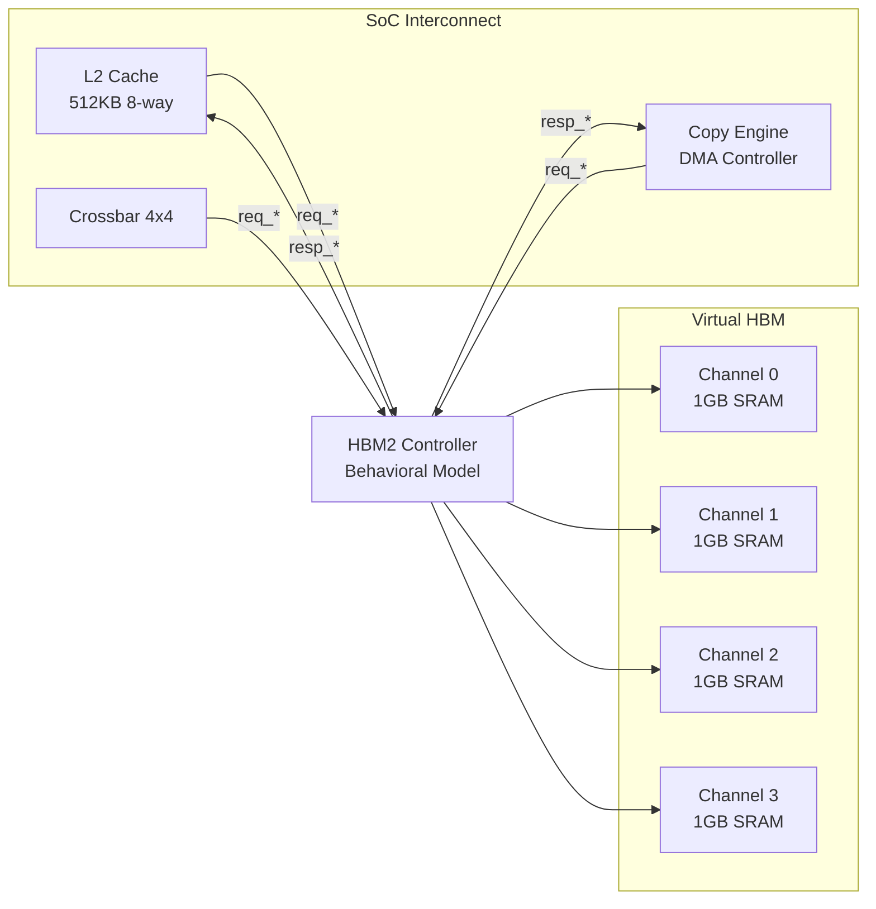

这是一个 **HBM2 高带宽内存控制器的行为级仿真模型**（Behavioral Model），用于替代真实的 HBM PHY + 控制器在仿真环境中运行，以加速验证 L2 Cache 和 Copy Engine 的功能逻辑。

---

## 1. 核心定位：仿真模型 vs 真实硬件

| 特性 | 此模块（仿真模型） | 真实 HBM2 控制器 |
|------|-------------------|-----------------|
| **存储介质** | 二维 SRAM 数组 `reg [DATA_W-1:0] hbm_mem[ch][addr]` | 3D TSV DRAM 堆叠 + PHY |
| **地址映射** | 线性扁平地址（Flat） | Bank/Row/Column 分层（复杂时序） |
| **访问延迟** | 固定 2 周期（约 2ns @1GHz） | 可变延迟（10-20ns，取决于 RAS/CAS/预充电状态） |
| **刷新机制** | 标志位模拟（`refresh_pending`） | 严格的 tREFI/tRFC 时序控制 |
| **ECC** | 软件随机注入错误（验证用） | 硬件 SECDED 编解码器 |
| **物理层** | 无（直接接口到 L2） | 复杂的 SerDes/TSV 接口训练（初始化/校准） |

**本质**：这是一个 **Cycle-Approximate Memory Model**，保留 HBM 的带宽和延迟特征，但移除复杂的 DRAM 时序，使仿真速度提升 **100-1000 倍**。

---

## 2. 架构详解

### 系统位置（数据流）

```
┌─────────────────────────────────────────────────────────────┐
│                    AI Accelerator SoC                        │
│                                                              │
│  ┌──────────┐    ┌──────────┐    ┌──────────┐              │
│  │   GPC    │◄──►│   L2     │◄──►│  Copy    │              │
│  │  Cluster │    │  Cache   │    │  Engine  │              │
│  └────┬─────┘    └────┬─────┘    └────┬─────┘              │
│       │               │               │                     │
│       │        ┌──────┴──────┐        │                     │
│       │        │  Crossbar   │        │                     │
│       │        │   4×4       │        │                     │
│       │        └──────┬──────┘        │                     │
│       │               │               │                     │
│       └───────────────┼───────────────┘                     │
│                       │                                      │
│                       ▼                                      │
│              ┌─────────────────┐                            │
│              │  HBM2 Controller │  ← 你当前的模块              │
│              │  (This Module)  │   (Behavioral Model)       │
│              └────────┬────────┘                            │
│                       │                                      │
│  ╔════════════════════╧════════════════════╗                 │
│  ║  HBM2 Memory Array (4 Channels × 1GB)   ║                 │
│  ║  ┌─────────┐ ┌─────────┐ ┌─────────┐   ║                 │
│  ║  │ Channel │ │ Channel │ │ Channel │   ║                 │
│  ║  │    0    │ │    1    │ │  2/3    │   ║                 │
│  ║  │ 1GB SRAM│ │ 1GB SRAM│ │ 1GB SRAM│   ║                 │
│  ║  └─────────┘ └─────────┘ └─────────┘   ║                 │
│  ╚═════════════════════════════════════════╝                 │
└─────────────────────────────────────────────────────────────┘
                              │
                              ▼
                    ┌─────────────────┐
                    │   Host System   │  (via PCIe)
                    └─────────────────┘
```

### 内部微架构

```
┌──────────────────────────────────────────────────────────┐
│                  hbm2_controller                          │
│                                                            │
│  ┌──────────────────────────────────────────────────────┐ │
│  │           Request Interface (from L2)                 │ │
│  │  req_addr[31:0]  → 地址解码                          │ │
│  │  req_wdata[511:0]→ 写数据 (512-bit)                  │ │
│  │  req_wr_en       → 读写控制                          │ │
│  │  req_be[63:0]   → 字节使能 (64 bytes granularity)     │ │
│  │  req_channel[1:0]→ 通道选择 (4 channels)              │ │
│  └─────────────────┬────────────────────────────────────┘ │
│                    │                                        │
│                    ▼                                        │
│  ┌──────────────────────────────────────────────────────┐ │
│  │         Channel & Address Mapping                     │ │
│  │  mem_addr = req_addr[27:4]  (Word Address)           │ │
│  │  ch_id    = req_channel[1:0] (Direct mapping)        │ │
│  │                                                      │ │
│  │  ┌────────────────────────────────────────────────┐ │ │
│  │  │ Memory Array: hbm_mem[4][256M]                 │ │ │
│  │  │ Type: reg [511:0]                             │ │ │
│  │  │ Total: 4GB (4 channels × 1GB)                 │ │ │
│  │  └────────────────────────────────────────────────┘ │ │
│  └─────────────────┬────────────────────────────────────┘ │
│                    │                                        │
│       ┌────────────┴────────────┐                         │
│       │                         │                         │
│       ▼                         ▼                         │
│  ┌──────────┐            ┌──────────┐                    │
│  │  Write   │            │  Read    │                    │
│  │  Path    │            │  Path    │                    │
│  │ (Combin) │            │ (Pipeline)                   │
│  │ 立即生效  │            │ 延迟2周期                     │
│  └──────────┘            └────┬─────┘                    │
│                               │                          │
│                               ▼                          │
│  ┌──────────────────────────────────────────────────────┐ │
│  │         ECC & Latency Pipeline                      │ │
│  │                                                      │ │
│  │  Stage 0: [valid]──►[data]──►[ch_id]                │ │
│  │              │          │        │                   │ │
│  │  Stage 1: [valid]──►[data]──►[ch_id]                │ │
│  │              │          │        │                   │ │
│  │  Output:  resp_valid  resp_rdata  resp_channel        │ │
│  │                                                      │ │
│  │  ECC Error Injection:                                │ │
│  │  if ($random % 1000 == 0) flip_bit(resp_rdata[0])   │ │
│  └──────────────────────────────────────────────────────┘ │
│                                                            │
└────────────────────────────────────────────────────────────┘
```

---

## 3. 关键技术机制

### A. 通道化架构（Pseudo-Channel）

HBM2 采用 **伪通道（Pseudo-Channel）** 架构提高并行度：

```verilog
// 4 个独立通道，每通道 1GB，共 4GB
hbm_mem [0:3][0:MEM_DEPTH-1]  // 4 channels × 256M × 64B

// 地址映射（简化版）
assign mem_addr = req_addr[MEM_ADDR_W+3:4];  // 64-byte word address
assign addr_channel = req_channel;             // 由上游指定通道
```

**与真实 HBM 的区别**：
- 真实 HBM2/3 每个 Stack 有 8-16 个伪通道，每通道独立 Bank 组
- 此模型使用 **软件通道化**，实际物理 Bank 冲突未建模（所有访问无冲突延迟）

### B. 延迟流水线（Latency Modeling）

使用移位寄存器模拟 HBM 的固定延迟：

```verilog
// 2-stage pipeline (LATENCY=2)
reg [DATA_W-1:0] ecc_pipeline [0:LATENCY-1];
reg              valid_pipeline [0:LATENCY-1];

// 每周期移位
for (i = 1; i < LATENCY; i = i + 1) begin
    ecc_pipeline[i] <= ecc_pipeline[i-1];
    valid_pipeline[i] <= valid_pipeline[i-1];
end

// 输出
resp_rdata <= ecc_pipeline[LATENCY-1];
resp_valid <= valid_pipeline[LATENCY-1];
```

**时序示例**（读操作）：
```
Cycle 0: req_valid=1, req_addr=0x1000 → 发起读请求
Cycle 1: 数据在 pipeline[0]
Cycle 2: 数据在 pipeline[1] → resp_valid=1, resp_rdata=数据
```

### C. ECC 错误注入（验证特性）

```verilog
// 模拟随机 ECC 错误（1/1000 概率）
if (($random % 1000) == 0) begin
    ecc_error <= 1'b1;
    resp_rdata[0] <= ~ecc_pipeline[LATENCY-1][0];  // 翻转 1 bit
end
```

**用途**：验证 L2 Cache 的 ECC 处理逻辑（纠错或报错重试机制）。

---

## 4. 接口信号详解

| 信号组 | 信号名 | 方向 | 位宽 | 说明 |
|--------|--------|------|------|------|
| **请求** | `req_addr` | Input | 32-bit | 字节地址（实际按 64B 对齐） |
| | `req_wdata` | Input | 512-bit | 写数据（64 字节，一行缓存） |
| | `req_wr_en` | Input | 1-bit | 1=写，0=读 |
| | `req_be` | Input | 64-bit | 字节使能（每 bit 控制 1 字节） |
| | `req_valid` | Input | 1-bit | 请求有效 |
| | `req_ready` | Output | 1-bit | 接收就绪（简化模型始终就绪） |
| | `req_channel` | Input | 2-bit | 目标通道 0-3 |
| **响应** | `resp_rdata` | Output | 512-bit | 读返回数据 |
| | `resp_valid` | Output | 1-bit | 读数据有效（延迟 2 周期后） |
| | `resp_ready` | Input | 1-bit | 下游就绪（来自 L2） |
| | `resp_channel` | Output | 2-bit | 响应对应的通道 ID |
| **调试** | `ecc_error` | Output | 1-bit | ECC 错误标志（脉冲） |
| | `ecc_error_count` | Output | 32-bit | 累计 ECC 错误数 |
| | `refresh_pending` | Output | 1-bit | 刷新中标志（仿真用） |

---

## 5. 与上下游的连接关系



**典型事务流程**：
1. **L2 Miss**：L2 Cache 向 HBM 发起读请求（`req_valid=1`, `req_wr_en=0`）
2. **地址映射**：根据 `req_channel` 选择通道，`mem_addr` 索引数组
3. **延迟等待**：数据经过 2 级 pipeline（模拟 10ns HBM 延迟）
4. **数据返回**：`resp_valid` 拉高，512-bit 数据返回给 L2 完成 refill
5. **ECC 检查**：如果发生注入错误，`ecc_error` 拉高，L2 可选择重试或报错

---

## 6. 使用场景与限制

### 适用场景
- **RTL 功能验证**：快速验证 L2 Cache 的 miss/refill 逻辑
- **软件仿真**：为 AI 编译器/驱动提供内存模型（无需真实 HBM 硬件）
- **性能建模**：估算理论带宽（4 通道 × 512-bit × 频率）

### 已知限制
- **无 Bank 冲突**：真实 HBM 同一 Bank 内访问需要等待 tRC，此模型无冲突
- **无刷新影响**：`refresh_pending` 仅为标志位，不实际阻塞访问
- **无温度/电压降额**：未建模真实 HBM 的温度依赖延迟
- **固定延迟**：真实 HBM 延迟随 Row Buffer 命中/缺失变化（CL=14 vs CL=40）

**总结**：这是用于 **快速功能验证** 的 HBM 行为模型，适合在 Verilator/仿真器中替代真实 HBM 控制器进行系统级验证。